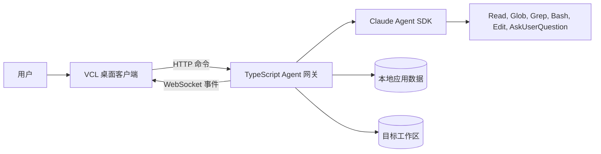
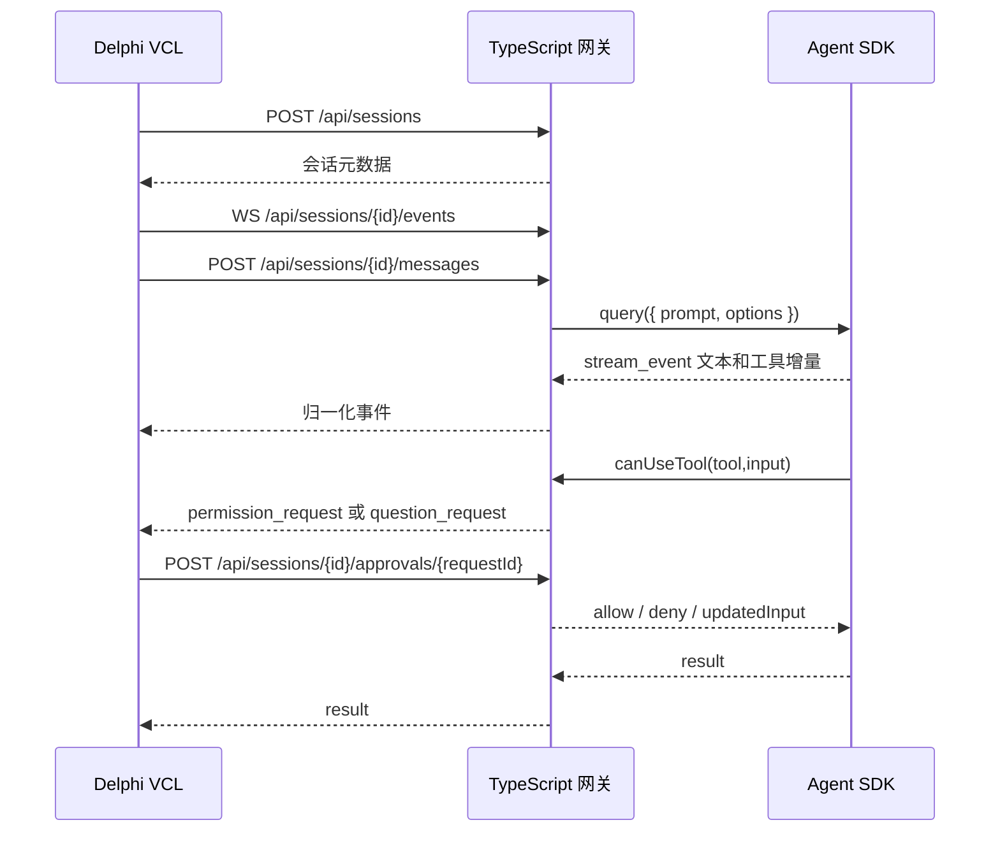

# Delphi + TypeScript Agent SDK 架构

## 目标

MzClaude 采用 VCL Windows 桌面客户端加本地 TypeScript Agent 网关的架构。Delphi 负责原生桌面体验，TypeScript 网关负责 Claude Agent SDK 集成、会话管理、流式事件、权限审批和审计。

首版目标是完成一个可运行的纵向闭环：选择工作区、创建会话、发送 prompt、展示流式输出、处理工具审批、恢复会话、停止运行中的任务。

## 进程边界

Delphi 与 Agent SDK 不直接耦合。所有 SDK 选项、权限模式、消息转换和错误处理都集中在 TypeScript 网关内。这样 Delphi 端只依赖稳定的本地协议，后续 SDK 升级不会直接影响 VCL UI。

## 模块职责

### Delphi VCL

- `apps/desktop-vcl/src/UI`：窗体、Frame 和控件布局。
- `apps/desktop-vcl/src/ViewModels`：聊天状态、会话列表、按钮启用状态和运行状态。
- `apps/desktop-vcl/src/Services`：网关进程启动、HTTP 客户端、WebSocket 客户端、设置持久化。
- `apps/desktop-vcl/src/Protocol`：与 JSON Schema 对齐的 DTO。
- `apps/desktop-vcl/src/App`：启动流程、依赖装配和全局错误处理。

VCL 事件处理器应保持轻量，只调用 ViewModel 或 Service，不直接拼接协议 JSON。

### TypeScript 网关

- `apps/agent-gateway/src/server`：HTTP/WebSocket 路由、鉴权、请求校验和响应映射。
- `apps/agent-gateway/src/agent`：Agent SDK `query()` 封装、`includePartialMessages` 处理、取消控制和选项构造。
- `apps/agent-gateway/src/sessions`：应用级会话注册表、SDK session_id、运行状态和 transcript 元数据。
- `apps/agent-gateway/src/permissions`：`canUseTool` 桥接、审批等待器和权限预设。
- `apps/agent-gateway/src/protocol`：协议类型、事件类型和 schema 校验。
- `apps/agent-gateway/src/config`：环境变量、默认配置、工作区 allowlist。
- `apps/agent-gateway/src/logging`：审计日志和调试日志，必须对敏感信息脱敏。

## 运行时流程

## 安全默认值

- 网关只绑定 `127.0.0.1`。
- 每次启动生成随机 token，所有 HTTP 和 WebSocket 请求都必须携带。
- 默认权限模式使用 `default` 或 `plan`，桌面 MVP 不使用 `bypassPermissions`。
- 低风险工具可以通过 `allowedTools` 预批准，高风险工具进入 `canUseTool` 审批。
- API key 不写入仓库，只来自环境变量或操作系统凭据存储。
- 审计日志记录审批、拒绝、工作区路径、会话 ID 和运行结果。

## 延后范围

首版暂不实现完整 IDE 能力，例如文件树、可视化 diff、内嵌终端、多 Agent 仪表盘和项目级设置同步。这些能力应在会话与审批闭环稳定后再扩展。
